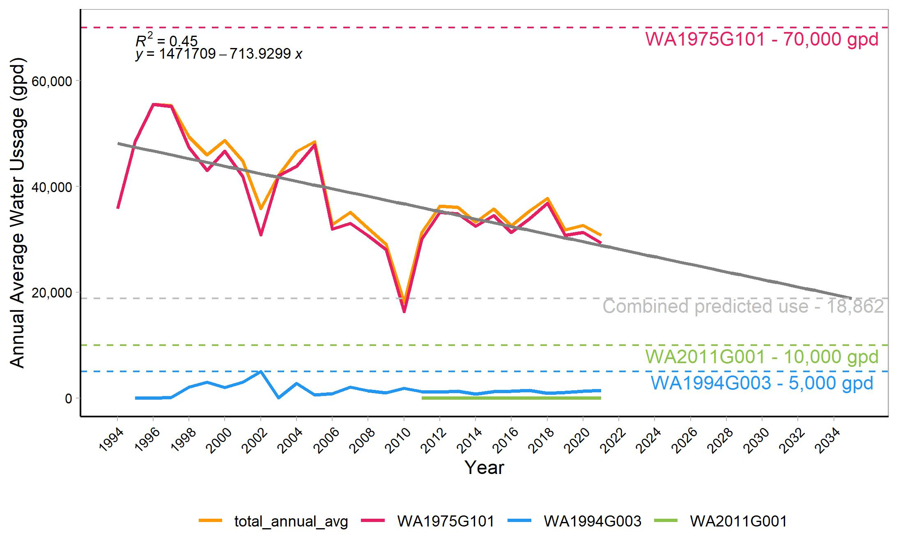

```{r}
# Note to self!!! To change sigfigs in ggplot stat_regline_equations you need to edit the function in the package 

# type :  "trace(ggpubr:::.stat_lm, edit = TRUE)" into the CONSOLE and edit line 13-14 to be whatever sig fig number you want
```

```{r}
rm(list = ls()) 
```

```{r setup}
knitr::opts_chunk$set(echo = TRUE)
```

```{r}
#Install/load packages
library("tidyr")
library("dplyr")
library("readr")
library("ggplot2")
library("scales")
library("ggpubr")
library("ggpmisc")
```

```{r}
# Code for joining data sets (could use left or right join instead) 
MyMerge       <- function(x, y){
  df            <- merge(x, y, all = TRUE)
  rownames(df)  <- df$Row.names
  df$Row.names  <- NULL
  return(df)
}
```

```{r}
# read in water usage data
waterusage <- read.csv("../Data/MtAetnaWashingtonCounty_WaterUse.csv") 
#str(waterusage)
unique(waterusage$permit)
```

```{r}

# get total avg usage across all permits for each year 
total_avg_usage <- waterusage %>% group_by(year) %>% summarise_at(vars(annual_avg), list(annual_avg = sum ), na.rm = TRUE)
total_avg_usage["permit"] <- c("total_annual_avg")

# Join the two datasets 
waterusage_total <- Reduce(MyMerge, list(waterusage, total_avg_usage))


ggplot(data = waterusage_total, aes(x = year, y= annual_avg, color = permit))+
  scale_color_manual(values = c("WA1975G101" = "#e81e63",
                                "WA1994G003" = "#2196f3",
                                "WA2011G001" = "#8bc34a", 
                                "total_annual_avg" = "#ff9800"))+
  geom_line(size = 1)+
  geom_smooth(data= waterusage_total %>% filter(permit == "total_annual_avg"), method = "lm", se = FALSE, fullrange = TRUE, linetype = "solid", aes(color = "black"))+
  stat_regline_equation(data= waterusage_total %>% filter(permit == "total_annual_avg"), label.x= 1995, label.y= 65000, color = "black", size = 3)+ #adds regression line formual 
  stat_cor(data= waterusage_total %>% filter(permit == "total_annual_avg"), aes(label=..rr.label..), label.x=1995, label.y=68000, color = "black", size = 3)+ #adds R2 
  scale_x_continuous(limits = c(1994, 2035), breaks = seq(1994, 2035, 2))+
  theme_light()+
  theme(panel.grid.major = element_blank(), 
        panel.grid.minor = element_blank(), 
        axis.text.x = element_text(color = "black", size = 8, angle = 45, hjust = 1),
        axis.text.y = element_text(color = "black", size = 8),
        axis.line = element_line(colour = "black", linetype = "solid"), 
        legend.position="none",
        plot.title = element_text(hjust = .5))+
  geom_hline(yintercept = 70000, color = "#e81e63", linetype= "dashed")+
  annotate("text", x = 2030, y= 68000, color = "#e81e63", label = "WA1975G101 - 70,000 gpd")+
  geom_hline(yintercept = 5000, color = "#2196f3", linetype= "dashed")+
  annotate("text", x = 2030, y= 3000, color ="#2196f3", label = "WA1994G003 - 5,000 gpd")+
  geom_hline(yintercept = 10000, color = "#8bc34a", linetype= "dashed")+
  annotate("text", x = 2030, y= 8000, color ="#8bc34a", label = "WA2011G001 - 10,000 gpd")+
  geom_hline(yintercept = 18862, color = "gray", linetype= "dashed")+
  annotate("text", x = 2030, y= 17500, color ="gray", label = "Combined predicted use - 18,862 gpd")+
  scale_y_continuous(labels = label_comma())+
  labs(y = "Annual Average Water Ussage (gpd)", x = "Year")+
  guides(color=guide_legend(" "))+
  theme(legend.position="bottom")
ggsave("../Figures/WashingtonCounty_WaterUsage.jpeg")
```


